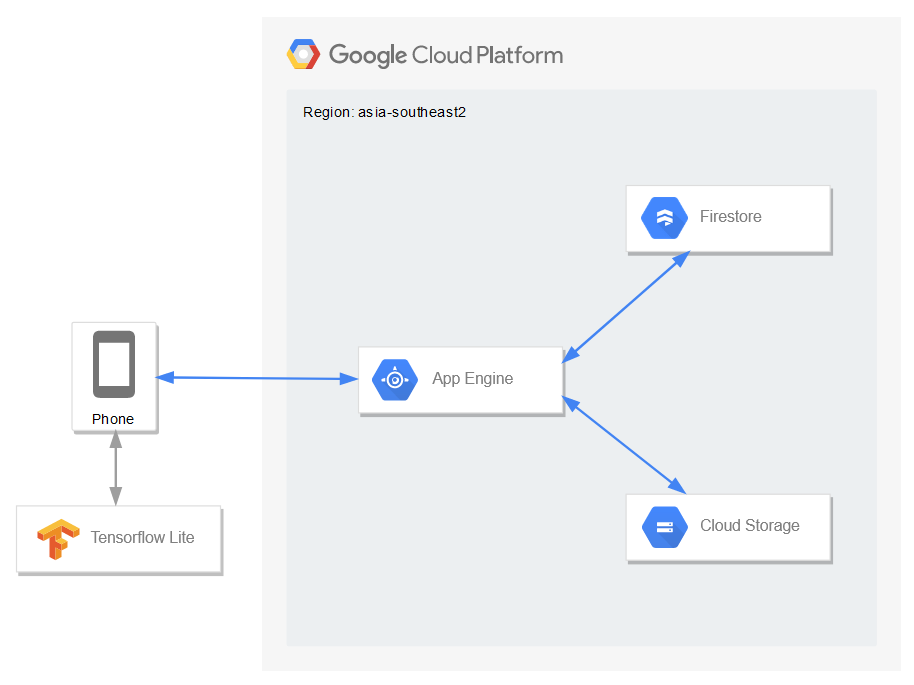
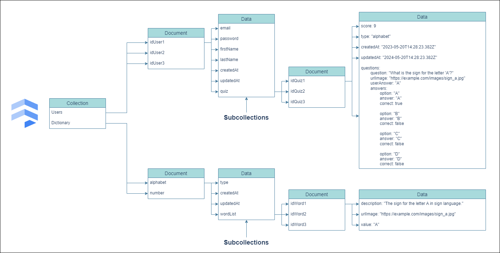

# Cloud Computing Documentation

## Diagram Architecture



## Firestore Database Structure



## Tech Architecture

- Node.js
- Express.js
- App Engine
- Cloud Storage
- Tensorflow Lite
- Firestore

## Dependencies

```JSON
{
  "@google-cloud/firestore": "^7.7.0",
  "bcrypt": "^5.1.1",
  "cookie-parser": "^1.4.5",
  "cors": "^2.8.5",
  "dotenv": "^16.4.5",
  "express": "^4.19.2",
  "express-validator": "^7.1.0",
  "firebase-admin": "^12.1.1",
  "jsonwebtoken": "^9.0.2",
  "multer": "^1.4.5-lts.1"
}
```

## Recap Endpoint Routes

| Route                  | HTTP Method | Description                 | Auth         |
| ---------------------- | ----------- | --------------------------- | ------------ |
| /login                 | POST        | Log in a user               | Not Required |
| /register              | POST        | Register a new user         | Not Required |
| /logout                | POST        | Log out a user              | Not Required |
| /profile               | GET         | Get user profile            | Required     |
| /dictionary/alphabet   | GET         | Get dictionary alphabet     | Required     |
| /dictionary/number     | GET         | Get dictionary number       | Required     |
| /quizzes/type/alphabet | GET         | Get alphabet quiz           | Required     |
| /quizzes/type/number   | GET         | Get number quiz             | Required     |
| /quizzes               | POST        | Submit a quiz               | Required     |
| /quizzes/history       | GET         | Get all user quiz history   | Required     |
| /quizzes/history?count | GET         | Get count user quiz history | Required     |
| /quizzes/{{ quizId }}  | GET         | Get quiz details            | Required     |

## API Endpoint

For detailed information on each API endpoint, refer to the <a href="./documentation/response.md"> API Endpoint Documentation</a>

## Installation

Prerequisites

```
Node.js (v18.x or later)
```

Clone The Project

```
git clone https://github.com/gesturo-team/Cloud-Computing.git
cd Cloud-Computing
```

Install Dependencies

```
npm install
```

.env

```
PORT=<Your_Port>
JWT_SECRET=<Your_JWT>
```

## Running the Application

Development Mode

```
npm run start:dev
```

Production Mode

```
npm start
```

<hr>

## Contributor

| Name               | University                    | Role            | Links                                                                                                                                                                                                                                                                                                   |
| ------------------ | ----------------------------- | --------------- | ------------------------------------------------------------------------------------------------------------------------------------------------------------------------------------------------------------------------------------------------------------------------------------------------------- |
| Ryan Rizky Pratama | Politeknik Negeri Banjarmasin | Cloud Computing | [](https://github.com/ryanriz) [](https://www.linkedin.com/in/ryanriz/)          |
| Reja Revaldy. F.   | Politeknik Negeri Banjarmasin | Cloud Computing | [](https://github.com/rejarevaldy) [](https://www.linkedin.com/in/rejarevaldyf/) |
